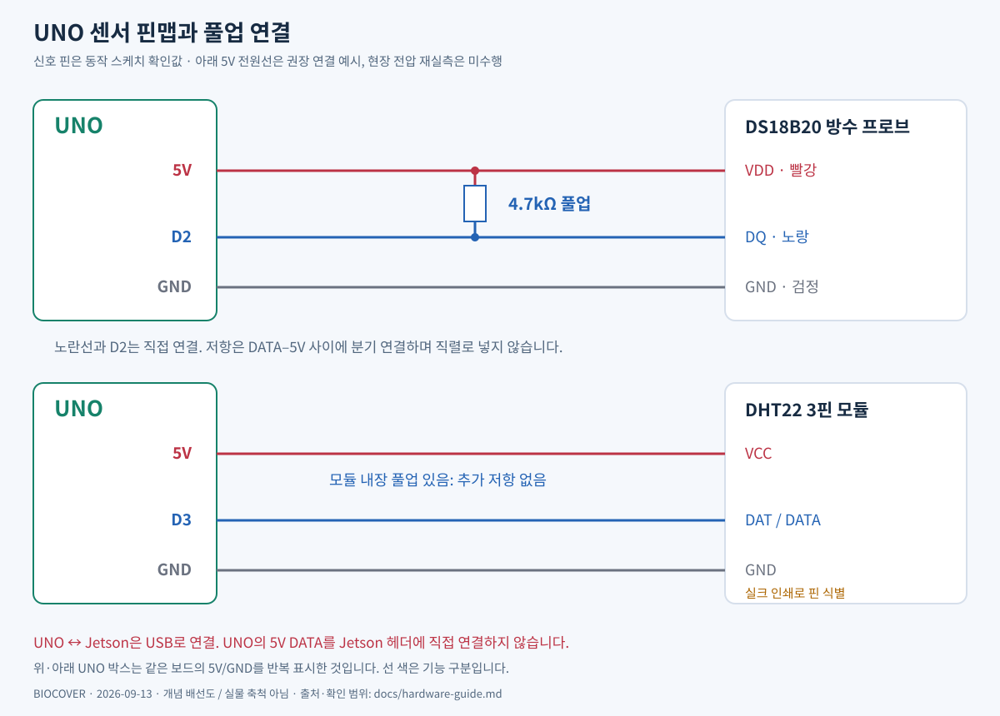
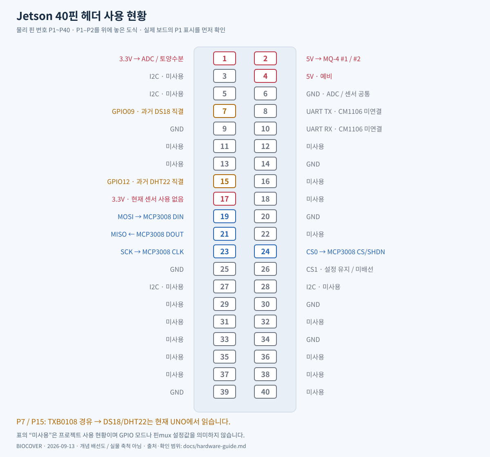
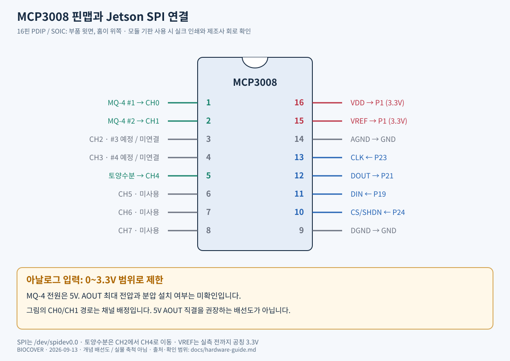

# 보드·센서 그림과 핀맵

기준일: **2026-09-13**. 현재 스케치와 측정 이력에 맞춰 직접 그린 SVG다.
실제 부품 배치 사진이나 PCB 제작용 회로도가 아니다. 실물 방향은 P1 표시,
칩의 홈/점, 모듈 실크 인쇄로 확인한다. 미확인 전원/모듈 사양은 아래에 구분했다.

## 전체 연결도


현재 센서는 **4종 5개**(MQ-4 2개, 토양수분, DHT22, DS18B20)다.
계획 전체는 **5종 8개**이며 MQ-4 2개와 CM1106은 미연결이다.
MCP3008은 ADC다. 과거 인계의 “센서 7종” 표현은 이 수량과 구분한다.

| 장치 | 역할 / 연결 | 확인 상태 |
|---|---|---|
| Jetson Orin Nano Super | USB/SPI 조회·분석 | 수신 확인 |
| UNO 호환 보드 / CH340 | DS18/DHT22 측정 → USB | 스케치 및 Jetson 수신 확인 |
| MCP3008 | 아날로그 → 10비트 SPI ADC | CH0/CH1/CH4 읽힘 |
| DS18B20 | UNO D2, 토양 온도 | USB 온도 읽힘 |
| DHT22 3핀 모듈 | UNO D3, 공기 온도·습도 | USB 온도·습도 읽힘 |
| MQ-4 #1 / #2 | ADC CH0/CH1, 유입·유출 측정용 | raw 확인, ppm 보정 전 |
| 정전용량식 토양수분 | ADC CH4 | raw 확인, 수분 % 보정 전 |
| MQ-4 #3 / #4 | CH2/CH3 예정, 위치 미정 | 미연결 |
| CM1106 | UART CO2 센서 | 미연결 |

기본은 화면 출력, CSV는 요청할 때만 저장한다. 기존 자동 저장 중지는 마지막
확인 당시 적용 대기였다. [최신 실행 이력](../history/2026-09-13/usb-and-current-status.md)

## UNO와 디지털 센서



**확인된 신호 핀은 DS18=D2, DHT22=D3**이다.
[실제 스케치](../hardware/arduino/biocover_sensors/biocover_sensors.ino)를 기준으로 한다.
연결된 보드는 CH340으로 식별됐으므로 공식 UNO R3의 USB 회로와 동일하다고
간주하지 않는다. 핀 명칭은 [Arduino 공식 UNO 핀맵](https://docs.arduino.cc/resources/pinouts/A000066-full-pinout.pdf)을 참조했다.

| 센서 단자 | UNO 연결 | 확인 범위 |
|---|---|---|
| DS18 DQ / 노란선 | D2 | 스케치, 정상 데이터 확인 |
| DS18 VDD / 빨간선 | 5V 권장 구성 | UNO 전환 후 실제 전압 미실측 |
| DS18 GND / 검은선 | GND | 공통 기준 전위 |
| DS18 풀업 4.7kΩ | DQ와 센서 전원 사이 | DATA 직렬 저항이 아닌 분기 연결 |
| DHT22 DAT/DATA | D3 | 스케치, 정상 데이터 확인 |
| DHT22 VCC | 5V 권장 구성 | Arduino 5V 동작 사용자 보고 |
| DHT22 GND | GND | 모듈 인쇄로 식별 |

DS18 전원 규격은 3.0~5.5V이며 도면은 외부 전원 3선 구성이다.
선 색은 사용자가 확인한 정보이지 모든 프로브에 공통인 규격이 아니다.
[DS18B20 제조사 자료](https://www.analog.com/media/en/technical-documentation/data-sheets/ds18b20.pdf)

DHT22는 **내장 풀업이 있는 3핀 모듈**이라는 사용자 확인을 반영했다.
벌크 4핀 센서의 물리 순서를 이 모듈에 적용하지 않는다.
UNO와 Jetson은 USB로 연결하며, UNO의 5V DATA를 Jetson 헤더에 연결하지 않는다.

## Jetson 40핀 사용 현황



P19는 헤더 물리 19번이다. GPIO line 19가 아니다. “미사용”은 프로젝트 사용
현황이지 GPIO 모드/핀mux 설정값이 아니다. 모든 대체 기능을 열거한 도면은 아니다.

| 현재 사용 | Jetson 물리 핀 | 상대 단자 |
|---|---|---|
| 3.3V | P1 | ADC VDD/VREF, 토양수분 VCC |
| 5V | P2 | MQ-4 #1/#2 VCC |
| GND | P6 등 | ADC AGND/DGND, 아날로그 센서 GND |
| MOSI | P19 | MCP3008 DIN |
| MISO | P21 | MCP3008 DOUT |
| SCK | P23 | MCP3008 CLK |
| CS0 | P24 | MCP3008 CS/SHDN |

Jetson-IO의 spi1, 문서의 SPI 번호, Linux 번호는 다른 번호체계일 수 있다.
현재 코드/실측은 **P19/P21/P23/P24 + /dev/spidev0.0** 기준이다.
P26은 이전 설정에 포함됐지만 ADC 배선에는 사용하지 않는다.
[NVIDIA 보드 사양 3.3절/표 3-3](https://developer.nvidia.com/downloads/assets/embedded/secure/jetson/orin_nano/docs/jetson_orin_nano_devkit_carrier_board_specification_sp.pdf)

P7(PAC.06)/P15(PN.01)는 과거 진단 핀이다. 오버레이/모듈이 남아 있어도 현재
센서 읽기는 UNO에서 한다. 두 핀의 TXB0108 경로는 1-Wire 직결에 부적합하다.
[TI TXB0108 자료](https://www.ti.com/lit/ds/symlink/txb0108.pdf),
[LOW 1.6V 실측 및 원인 분석](../history/2026-09-13/gpio-os-audit.md)

## MCP3008과 아날로그 센서



홈을 위에 둔 칩 윗면에서 왼쪽은 1→8, 오른쪽은 위에서 16→9다.
도면은 16핀 PDIP/SOIC용이다. 어댑터 모듈은 자체 인쇄와 회로를 확인한다.
[Microchip MCP3008 데이터시트](https://ww1.microchip.com/downloads/aemDocuments/documents/MSLD/ProductDocuments/DataSheets/MCP3004-MCP3008-Data-Sheet-DS20001295.pdf)

| ADC 채널 | 칩 핀 | 배정 | 전원 |
|---|---:|---|---|
| CH0 | 1 | MQ-4 #1 | Jetson 5V |
| CH1 | 2 | MQ-4 #2 | Jetson 5V |
| CH2 | 3 | MQ-4 #3 예정 | 미연결 |
| CH3 | 4 | MQ-4 #4 예정 | 미연결 |
| CH4 | 5 | 토양수분 | Jetson 3.3V |
| CH5~CH7 | 6~8 | 미사용 | — |

전압 계산은 `raw / 1023 × 3.3`이며 실제 VREF 보정 전의 근사값이다.
MQ-4 ppm/토양수분 %와 다르다. MQ-4와 토양수분 모듈의 제조사/리비전은
미확정이므로 물리 핀 순서를 임의로 그리지 않았다. VCC/GND/AOUT로 식별한다.
디지털 DO는 현재 사용하지 않는다.

**MQ-4의 5V 전원과 ADC 3.3V 입력 범위는 별개다.** AOUT 최대 전압과
분압 유무는 아직 미확인이다. CH0/CH1 그림은 채널 배정이며 5V AOUT 직결 권장이 아니다.

## 파일·운영 정보

| 항목 | 위치 / 값 |
|---|---|
| UNO USB | /dev/biocover-uno, VID:PID 1a86:7523 |
| 통신 | 9600bps, 8N1, 약 2초마다 CSV 전송 |
| 출력 헤더 | time_ms,DS18B20_C,DHT22_C,humidity_pct |
| 통합 화면 조회 | scripts/show_all_sensors.py |
| 제안 저장 간격 | 5초; 통합 5초 저장 루프는 아직 미구현 |
| 과거 CSV | data/arduino/ (Git 제외) |
| 설치·복원 | [USB 문서](arduino-usb.md) |

## 도면 수정·재생성

제조사 이미지를 복제하지 않고 프로젝트용 SVG를 작성했다. 원문 문서는 링크로
제공한다. 배선 변경 시 아래 생성기와 텍스트 표, 동작 스케치를 함께 갱신한다.

```bash
python3 docs/diagrams/generate.py
```

외부 Python 패키지 없이 재생성한다. GitHub는 SVG를 직접 표시한다.
PNG 내보내기는 설치된 librsvg 도구를 사용할 수 있다.

```bash
rsvg-convert docs/diagrams/uno-sensor-wiring.svg -o /tmp/uno-sensor-wiring.png
```
