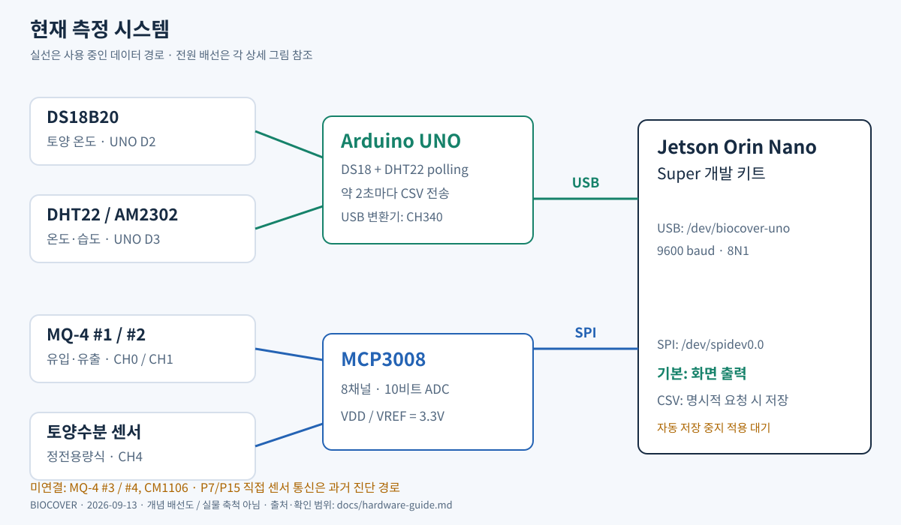

# 배선 및 연결 상태

**현재 구성:** DS18은 UNO D2, DHT22는 UNO D3에서 읽고 Jetson에 USB로 전송합니다.
[그림·핀맵·제조사 자료를 모은 하드웨어 가이드](hardware-guide.md)

아래 초기 직결 설명은 과거 진단 이력입니다. 현재 연결 표는 UNO 전환을 반영합니다.

**최신 정정:** P7과 P15는 개발 키트의 TXB0108 전압 변환기를 거칩니다.
DS18의 P7+4.7kΩ 직결은 검증된 권장 배선이 아닙니다. LOW 명령 중 1.6V가
실측되었고, 변환기와 풀업의 충돌 계산값과 부합합니다. 아래 표는 기존 연결
기록입니다. DHT22의 내부 풀업도 영향 가능성이 있어 연결 구조 재검토가 필요합니다.
[실측·제조사 근거](../history/2026-09-13/gpio-os-audit.md)

2026-09-13 사용자 정정 반영. P 번호는 40핀 헤더의 **물리 핀 번호**입니다.
배선은 사용자 제공 정보이며 전압·저항을 계측기로 확인한 것은 아닙니다.

| 장치 | 신호 연결 | 전원 | 현재 상태 |
|---|---|---|---|
| MCP3008 | DIN P19, DOUT P21, CLK P23, CS P24 | VDD/VREF P1 3.3V | 연결, ADC 값 읽힘 |
| MQ-4 #1 유입 | AOUT CH0 | P2 5V | 연결 |
| MQ-4 #2 유출 | AOUT CH1 | P2 5V | 연결 |
| MQ-4 #3 | AOUT CH2 예정 | 5V 예정 | **미연결** |
| MQ-4 #4 | AOUT CH3 예정 | 5V 예정 | **미연결** |
| 정전용량식 토양수분 | AOUT CH4 | P1 3.3V | 연결 |
| DHT22/AM2302 | DATA UNO D3, 내장 풀업 | UNO 5V 권장 구성 | USB 온도·습도 수신 성공 |
| DS18B20 | DATA UNO D2, DATA–전원 4.7kΩ 풀업 | UNO 5V 권장 구성 | USB 온도 수신 성공 |
| CM1106 | TX P10 / RX P8 예정 | P2 5V 예정 | **미연결** |

전 장치 공통 GND. MCP3008 AGND·DGND도 GND에 연결합니다. CH5~CH7은 미사용입니다.
토양수분은 CH2에서 CH4로 변경되었습니다. DHT22 DATA는 현재 UNO D3입니다.
UNO 전원/저항 상태는 전환 후 직접 재실측하지 않았으며 전원 표시는 권장 구성입니다.

Jetson-IO의 spi1 (P19·21·23·24·26)은 이 장치에서 `/dev/spidev0.0`의 CS0 경로에 대응합니다.
P15는 gpiochip0 line 85 (PN.01), P7은 line 144 (PAC.06)입니다.
이는 현재 보드의 로컬 NVIDIA 핀 매핑 기준이며 다른 보드에 그대로 적용하지 않습니다.

MCP3008 VREF/VDD가 3.3V이므로 ADC 입력 범위를 0~3.3V로 제한해야 합니다.
MQ-4 AOUT의 분압 유무 및 실제 최대 전압은 아직 확인되지 않았습니다.
참고: [Microchip MCP3008 데이터시트](https://ww1.microchip.com/downloads/aemDocuments/documents/MSLD/ProductDocuments/DataSheets/MCP3004-MCP3008-Data-Sheet-DS20001295.pdf).

## 과거 Jetson 직결 당시 사용자 추가 확인

2026-09-13: DS18B20 DATA 풀업 저항이 실제로 미연결이라고 확인됨. DATA(P7)–3.3V(P1)에 4.7kΩ 저항 추가 안내, 연결 완료는 아직 미확인.
DHT22는 사용자 Arduino 환경에서 정상 읽기 보고. Jetson 측 유효 프레임 확보는 계속 미완료.

사용자 후속 확인: DS18 DATA 풀업 저항 연결 완료 보고. 재부팅 후 00-… 잘못된 ID는 보이지 않지만 정상 센서 ID도 아직 없음.
DHT22는 실제 VCC=P1 공유, 전원 실측 3.4V 보고. 기존 P17 표기는 초기 계획.
